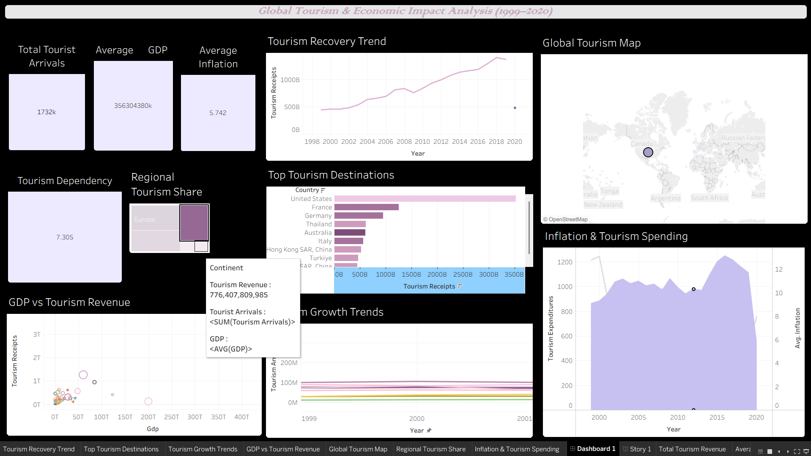

# 🌍 Global Tourism Economic Impact Analysis

An end-to-end data analysis project exploring how international tourism shapes the economies of countries around the world — using 25 years of arrivals, receipts, GDP, and macroeconomic data, brought together in an interactive Tableau dashboard.



---

## 📌 Objective

Tourism is a major economic driver for many nations, but its impact varies widely by country and over time. This project sets out to:

- Analyze how tourism affects a country's economy by examining tourism receipts, arrivals, GDP contribution, and dependency levels.
- Understand the relationship between tourism activity and broader economic indicators such as inflation, unemployment, and revenue per tourist.
- Identify tourism-dependent economies and assess their exposure to risk from over-reliance on tourism income.
- Support tourism boards, economists, and policymakers with data-driven insights through an interactive dashboard.

---

## 🗂️ Repository Structure

```
Global-Tourism-Economic-Impact-Analysis/
│
├── data/
│   ├── world_tourism_economy_data.csv          # Raw combined tourism & economic dataset
│   ├── world_tourism_economy_data_clean.csv    # Cleaned & processed dataset used for analysis
│   └── country_continent_lookup.csv            # Country-to-continent mapping reference table
│
├── images/
│   ├── overview.png       # Project overview
│   ├── objective.png      # Project objectives
│   ├── data.png           # Data sources & structure
│   ├── insights.png       # Key insights summary
│   └── Dashboard.png      # Final Tableau dashboard preview
│
├── presentation/
│   └── linkedin2.mp4      # Video walkthrough / presentation of the project
│
├── tableau/
│   └── World_Tourism_Analysis with dashboard final.twbx   # Packaged Tableau workbook
│
└── README.md
```

---

## 🧾 Dataset Overview

The dataset combines global tourism statistics with macroeconomic indicators, covering **~218 countries** from **1999 to 2023**.

Key fields include:

| Category | Fields |
|---|---|
| **Tourism Activity** | Tourism Arrivals, Tourism Departures, Tourism Dependency %, Revenue per Tourist |
| **Economic Indicators** | GDP, Inflation, Unemployment |
| **Tourism Revenue** | Tourism Receipts, Tourism Expenditures, Tourism Exports |
| **Reference / Metadata** | Country, Country Code, Continent, Year, Data Era, Row Type |

`world_tourism_economy_data_clean.csv` is the primary analysis-ready file — cleaned, standardized, and joined with continent mapping from `country_continent_lookup.csv`.

---

## 🛠️ Tools & Technologies

- **Tableau** — data visualization and interactive dashboard building
- **CSV / Excel-based data cleaning** — preparing raw tourism and economic data for analysis
- **Data modeling** — joining tourism datasets with country/continent lookup tables

---

## 📊 Dashboard & Key Insights

The interactive Tableau dashboard (`tableau/World_Tourism_Analysis with dashboard final.twbx`) allows users to explore:

- Global and continent-level trends in tourism arrivals and receipts over time
- Countries most economically dependent on tourism, based on Tourism Dependency %
- The relationship between tourism revenue and macroeconomic indicators like GDP, inflation, and unemployment
- Revenue generated per tourist across different regions and income levels

📌 See `images/insights.png` for a summary of key findings, and `images/overview.png` / `images/objective.png` for the project framing.

🎥 A video walkthrough of the analysis and dashboard is available in `presentation/linkedin2.mp4`.

---

## 🚀 Getting Started

1. **Clone the repository**
   ```bash
   git clone https://github.com/NikitaRakhade29/Global-Tourism-Economic-Impact-Analysis.git
   ```
2. **Explore the data** in the `data/` folder using your tool of choice (Excel, Python, Tableau Prep, etc.)
3. **Open the dashboard**
   - Install [Tableau Desktop](https://www.tableau.com/products/desktop) or use [Tableau Public](https://public.tableau.com/)
   - Open `tableau/World_Tourism_Analysis with dashboard final.twbx`
4. **Watch the walkthrough** in `presentation/linkedin2.mp4` for a guided tour of the findings.

---

## 👤 Author

**Nikita Rakhade**
[GitHub](https://github.com/NikitaRakhade29)

---

## 📄 License

No license has been specified for this repository. If you'd like others to freely use or build on this work, consider adding an open-source license such as [MIT](https://choosealicense.com/licenses/mit/).
